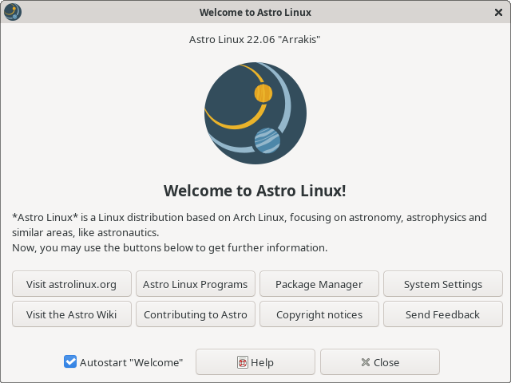
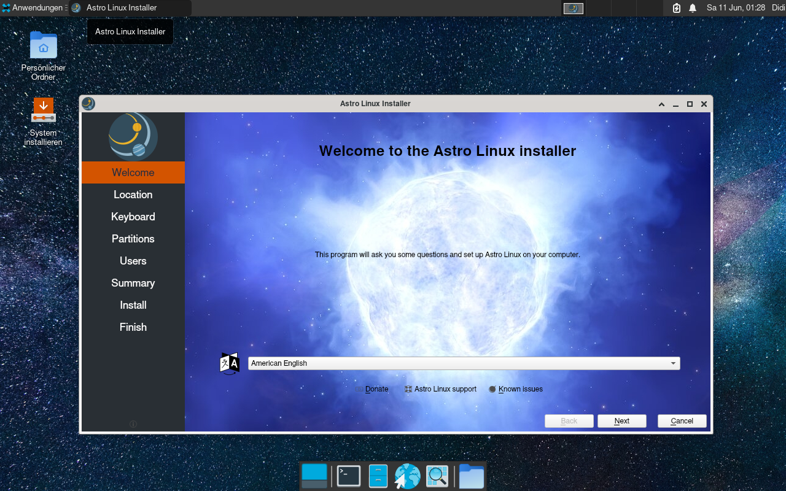

# AstroLinux

*__Astro Linux__* is a Linux distribution based on Arch Linux, focusing on astronomy, astrophysics and similar areas, like astronautics.

#### Why should I use Astro Linux?

TODO

Features

ISO Size

Packages included

#### What programs are included?

On the installation image / after a disk install:

- Stellarium

Optinal programs the user might want to install:

- TODO

#### Screenshots

Astro Linux Welcome App

Astro Linux Installer (using Calamares)

#### Known issues

See [here](https://github.com/amstelchen/AstroLinux/issues)

#### Licenses

*__Astro Linux__* is licensed under the terms of the **GPL-3.0-or-later** (see [LICENSE](LICENSE)).  
<a href="https://www.flaticon.com/free-icons/astronomy" title="astronomy icons">Astronomy icons created by Freepik - Flaticon</a>  
<a href="https://www.flaticon.com/free-icons/landing-page" title="landing page icons">Landing page icons created by Flat Icons - Flaticon</a>  
